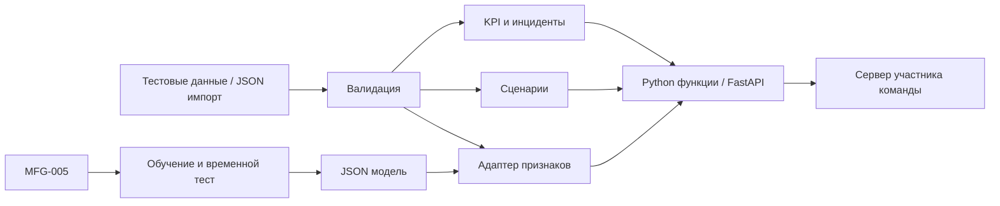

# Allur Digital Twin — backend + frontend

ИИ и расчётный backend для кейса №2 «Цифровой двойник автомобильного завода», Qostanai Industry Hackathon. Содержит экспериментальную модель риска простоя, KPI, выявление отклонений, сценарии изменения мощности и остановки участка. В `frontend/` интегрирован предоставленный React-интерфейс с экраном серверных данных, сценариями, историей и воспроизведением.

**Быстрый запуск готового комплекта:** распаковать ZIP → `start-local.cmd` → http://127.0.0.1:8001/app/. Frontend собран, Windows-зависимости включены для офлайн-установки. Нужен Python 3.12 x64. Подробности, резервный запуск, временная ссылка и постоянное размещение: [LAUNCH.md](docs/LAUNCH.md).

Серверное состояние: `GET /state`; история: `GET /history`; применение остановки: `POST /scenario`; сброс: `POST /reset`. Управление воспроизведением: `POST /api/replay/start` и `/api/replay/stop`. Интерфейс получает `/api/session` каждую секунду. Каждый посетитель использует общий демонстрационный сеанс в памяти.

Формат `/state` сохраняется. Без параметров он возвращает текущую проекцию; с `date` или `scheduled_hours` — исходный исторический срез. Исходный `/api/scenarios/stop` остаётся предварительным расчётом, а `/scenario` применяет результат к отображаемому состоянию. Фактические KPI не переписываются гипотетическими результатами.

## Интеграция с участником команды

**Формат `/state` сохранён:** `{"sections": [...]}`. Поля участка — строго `id`, `status`, `throughput`, `queue`, `downtime_minutes`, `defect_rate`.

| Поле | Формат и единицы |
|---|---|
| `id` | `welding`, `painting`, `assembly` |
| `status` | `running`, `warning`, `stopped`; статус учебного среза |
| `throughput` | Авто/час календарного периода; факт / 8 часов по умолчанию |
| `queue` | Автомобили; `null`, пока нет фактических данных об очереди |
| `downtime_minutes` | Минуты по журналу оборудования участка за выбранную дату |
| `defect_rate` | Доля 0…1; 0.051724 означает 5.1724% |

Готовые файлы: [данные](data/case/case.json), [состояние 02.10](examples/state_2026-10-02.json), [расчётный модуль](allur/integration.py), [вход остановки](examples/stop_input.json), [результат](examples/stop_result.json), [интеграция](docs/INTEGRATION.md), [OpenAPI](docs/openapi.json). Функции можно импортировать в существующий сервер; отдельный FastAPI-процесс необязателен.

## Запуск API

Нужен **Python 3.12**. Ключи внешних сервисов не требуются. Артефакт модели и тестовые записи включены; скачивать обучающие данные для запуска не нужно.

```bash
git clone https://github.com/alina-kovalenko/Industry_Hackathon_Allur.git
cd Industry_Hackathon_Allur
python -m venv .venv
```

Windows PowerShell:

```powershell
.\.venv\Scripts\python.exe -m pip install -r requirements.txt
.\.venv\Scripts\python.exe -m uvicorn allur.api:app --host 127.0.0.1 --port 8001
```

macOS / Linux:

```bash
.venv/bin/python -m pip install -r requirements.txt
.venv/bin/python -m uvicorn allur.api:app --host 127.0.0.1 --port 8001
```

Порт 8001 выбран, чтобы не занимать 8000 существующего сервера команды. Проверка: [health](http://127.0.0.1:8001/api/health), [state](http://127.0.0.1:8001/state), [API](http://127.0.0.1:8001/docs). Swagger загружает оформление из CDN; само API и модель работают без него. OpenAPI доступен по `/openapi.json`.

Docker: `docker compose up --build` (порт хоста 8001). Выполненные проверки описаны в [VALIDATION.md](docs/VALIDATION.md).

## Возможности

- Производительность, загрузка, оценочный OEE, качество, выполнение плана и инциденты.
- Кандидат в узкое место по минимальному годному выпуску с оговоркой о неизвестных запасах.
- Сценарии улучшения и дополнительной остановки с последовательными ограничениями мощности и потерями качества.
- Логистическая модель риска ≥60 минут незапланированного простоя в следующей имеющейся записи линии. Артефакт JSON, без pickle.
- Временное разделение обучения/валидации/теста, базовые сравнения, метрики и происхождение данных.
- Локальный аналитик по рассчитанным числам: детерминированная маршрутизация вопросов, не LLM.
- Валидация, атомарный импорт производственных записей, тесты и GitHub Actions.

## Данные и ограничения

В DOCX — 6 строк производства/качества, 4 события простоя и 3 месячных плана. PDF использован как описание требований. Источник не уточняет, строка описывает смену или сутки: при двух сменах по 8 часов фактическое время в строках — 7,2–8 часов. По умолчанию строка считается **одним периодом 8 часов**. Период 16 часов допускается как альтернативная интерпретация; в суточном сценарии его нельзя дополнительно умножать на две смены.

Идеальный цикл отсутствует и оценён как длительность периода / план, поэтому OEE оценочный. Минуты инцидентов повторно из времени работы не вычитаются. За 02.10.2026 итог по сборке — **119 автомобилей, 117 годных**; выпуск последовательных участков не суммируется. Планы моделей дают **4 800**, общий целевой план — **5 500**; возвращается предупреждение.

Предел кейса — **60 минут в сутки на одну единицу критического оборудования**. Перечень критического оборудования отсутствует, поэтому порог используется для предварительной проверки. Это не лимит суммы простоев всех участков. Сценарий свыше 60 минут разрешён и возвращает `threshold.exceeded=true` с учётом предыдущих событий агрегата.

| Источник | Применение | Лицензия источника |
|---|---|---|
| [XpertSystems MFG-005](https://huggingface.co/datasets/xpertsystems/mfg005-sample) | ML на 3 000 синтетических наблюдений | CC BY-NC 4.0 |
| [Zenodo 17855209](https://zenodo.org/records/17855209) | Профиль OEE/простоев производства керамики | CC BY 4.0 по API записи |
| [Zenodo 17649175](https://zenodo.org/records/17649175) | Профиль месячных OEE/Cpk автомобильного контроля | CC BY 4.0 по API записи |

Разные производства и периоды не объединены в одну обучающую таблицу. Сырые файлы не включены в Git: [загрузчик](scripts/download_data.py) проверяет контрольные суммы. Описание и атрибуция: [DATA.md](docs/DATA.md), [модель](docs/MODEL_CARD.md). Коммерческое использование MFG-005 и производных моделей требует учитывать ограничение NC источника.

**Модель экспериментальная:** ROC-AUC временного теста ≈0,616, доля ложных тревог ≈77,9% при выбранном пороге. На истории Allur точность не проверена. Следующая запись источника не обязательно следующая смена: медианный разрыв тестовых пар 14 дней. Балл не является калиброванной вероятностью отказа, не должен автоматически менять состояние оборудования и не используется для физического сценария остановки. Два дня Allur достаточны для демонстрации интеграции, но не для доказательства качества промышленного прогноза.

## Архитектура и API



| Метод | Адрес | Результат |
|---|---|---|
| GET | `/state?date=2026-10-02&scheduled_hours=8` | DTO `sections` |
| GET | `/api/dashboard` | KPI, инциденты и модель |
| GET | `/api/model` | Метрики и ограничения модели |
| POST | `/api/predict` | Оценка риска по переданной истории без изменения состояния |
| GET | `/api/data-sources` | Профили трёх источников |
| POST | `/api/scenarios/stop` | Дополнительная остановка |
| POST | `/api/simulate` | Изменение мощности/качества |
| POST | `/api/assistant` | Объяснение текущего среза |
| POST | `/api/ingest` | Импорт производства в память |
| GET | `/api/health` | Состояние API |

Импорт: `{"records": [...]}` с полями `date`, `line_id`, `planned_units`, `actual_units`, `runtime_hours`, `utilization_pct`, `defects`. Для новой даты нужны все три участка. Пакет целиком проверяется до обновления. Журнал простоев не изменяется; импорт хранится до перезапуска. Для браузерного frontend задайте `ALLUR_ALLOWED_ORIGINS=http://localhost:3000`; серверному вызову CORS не нужен.

## Обучение и проверки

```bash
python -m pip install -r requirements-dev.txt
python scripts/download_data.py
python scripts/profile_data.py
python scripts/train.py
python -m pytest -q
```

Команды выполняются в виртуальном окружении. Загрузка и профилирование нужны для воспроизведения обучения. CI запускает тесты без скачивания внешних данных.

Для пилота нужны сменные записи Allur с временными метками, идеальным циклом, классификацией остановок, очередями, межоперационными запасами и метками отказов. Модель сначала проверяется на будущих периодах и работает в теневом режиме. Текущий API — локальный MVP с состоянием в памяти; авторизация, постоянная БД и подключение PLC/MES требуют отдельной реализации.
